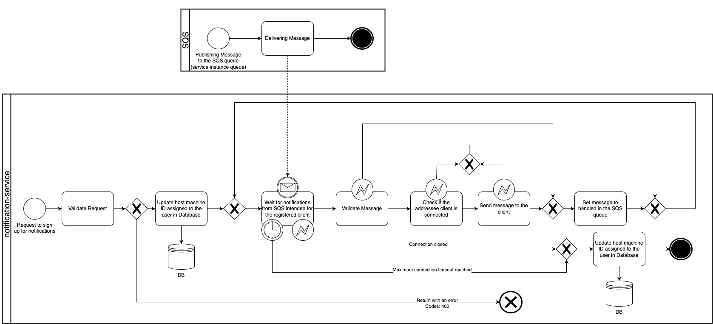
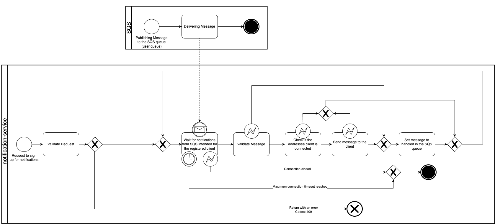

# REST long-polling microservice for near-real-time notification delivery

## Introduction
This is a Go application that provides a JWT authenticated REST API for clients and makes
it possible for them to receive notifications in near-real-time from any service in the
cloud architecture.

### How it works
The service supports two operation types:
1. <b>Dedicated SQS queue for the notification-service instance:</b> Each instance of the application has a unique ID (generated at startup if not provided).
The service receives notifications from this dedicated SQS queue and forwards it to the corresponding client, if it is connected.
In case it is not connected, or the delivery was not successful for whatever reason, the notification will not be deleted from the queue,
allowing us to forward it to a Dead-Letter-Queue (DLQ) for proper handling. The retry policy depends on the SQS configuration,
if the queue delivers it again the service will retry the delivery.
The drawback and limitation of this approach is that it requires a database, where we store which client is connected to which application instance.
The sender applications needs select the SQS topic accordingly. 
This solution is recommended for prototyping, or if we want to keep the number of SQS queues low and also the number of notifications we want to deliver is not too high, since 
due to the database operations it is scalable only to a certain extent.

2. <b>Dedicated SQS queue for each client:</b> We utilize the fact that basically in all applications each client (user) has a unique ID, which can be used to create 
a dedicated SQS queue for each client. When the user connects to an instance of the notification service, the service will start to consume the notifications from the dedicated SQS queue.
The approach does not require any database, the notification publisher service only needs to publish the notification to the corresponding SQS queue, which can be derived from the UUID of the client.
It is recommended to move the messages from each SQS queue to a DLQ after a predefined amount of time and optionally deliver it via email or push notification service. If the messages persist
in the queue for an unlimited amount of time, you risk that client will receive high number of notifications at once when it connects to the notification service after a longer offline period.


### Deployment
The service can be deployed in a highly scalable and highly available manner.
In case of the (1) configuration (see above) tt uses a database to store client sessions, 
currently it is running on PostgreSQL (DynamoDB or Redis are also good fits).

### Authentication
The service supports JWT authentication. JWT tokens are expected in the "Authorization" header of the request,
the URL to the jwks.json file must be provided as an environment variable.

### Session Management (1. configuration only) 
Each instance of the application receives deliverable messages from a dedicated SQS queue. It means, that if a message generator
service wants to send a message to client 'A', it needs to know exactly which notification-service instance 'A' is currently connected to.
That's when the database comes into play. When a client connects to an instance of the notification-service, the service assigns its 
unique ID to the client and stores it in the database. When a message generator service wants to send a message to client 'A', it needs to 
retrieve the corresponding notification-service ID from the database and send the message to the corresponding SQS queue.

## Use cases
Has been designed for a mobile application, to avoid extensive usage of push notifications or websocket connections. The service can be deployed beside any other API
service, preferably behind a load balancer. It can be handy for any mobile application where real-time notifications must be delivered while the 
application is in active state, for long-running IoT software or even for browser applications.

## Features
<b>JWT Authentication:</b> User authentication is based on JWT tokens.
<b>Easy to use with AWS SQS</b>
<b>Logging:</b> Using Uber zap library for logging

## Usage
0. Clone the repository
```
git clone https://github.com/szabolcsgarda/notification-service.git'
cd notification-service
```

### Deployment on your machine
13. Install dependencies
```
go install
```

2. Set the required environment variables
   See below the Environment variables section for details.

3. Start the server

```
go run main.go
```

### Build Docker image
1. Build the Docker image
```
docker build -t notification-service -f Dockerfile-dev .
```

2. Run the Docker container
   The application is conveniently deployable as a Docker container, offering flexibility
   and ease of scaling. However, it's important to note that by default, the Docker
   container does not have access to the host machine's AWS secrets. The application requires a
   set of environmental variable (see below), which determines SQS usage, provide database address
   and credentials. Also recommended to use AWS role-based permissions.
```
docker run -p 3000:3000 -e DB_HOST="your-db-host" notification-service
```
## API documentation
See /api/notification-service.yaml for details!

## Environmental variables
The following environment variables are used by the application:

| Variable Name                     | Description                             |Required   | Default Value   |
|-----------------------------------|-----------------------------------------|-----------|-----------------|
| `PORT`                            | REST API port                           | No        | 8080            |
| `SQS_QUEUE_NAME_PREFIX`           | Prefix of the SQS queue                 | Yes       | -               |
| `NOTIFICATION_SERVICE_CLIENT_ID`  | Client ID (generated if not provided)   | No        | random          |
| `SQS_QUEUE_URL`                   | Only needed if above param. provided    | No        | -               |
| `COGNITO_JWK_URL`                 | URL to jwks.json to validate user JWK-s | Yes       | -               |
| `DB_HOST`                         | Database host                           | No        | localhost       |
| `DB_USER`                         | Database user                           | No        | my_user         |
| `DB_PASSWORD`                     | Database password                       | No        | my_password     |
| `DB_NAME`                         | Database name                           | No        | message_service |
| `LOGGING_MODE`                    | Logging mode for zap logger             | No        | DEVELOPMENT     |
| `SQS_USER_QUEUE_BASE_URL`         | Base queue URL in case of mode 2        | No        | -               |
| `NOTIFICATION_SERVICE_MODE`         | Specify operation mode (1 or 2)         | No        | 1               |